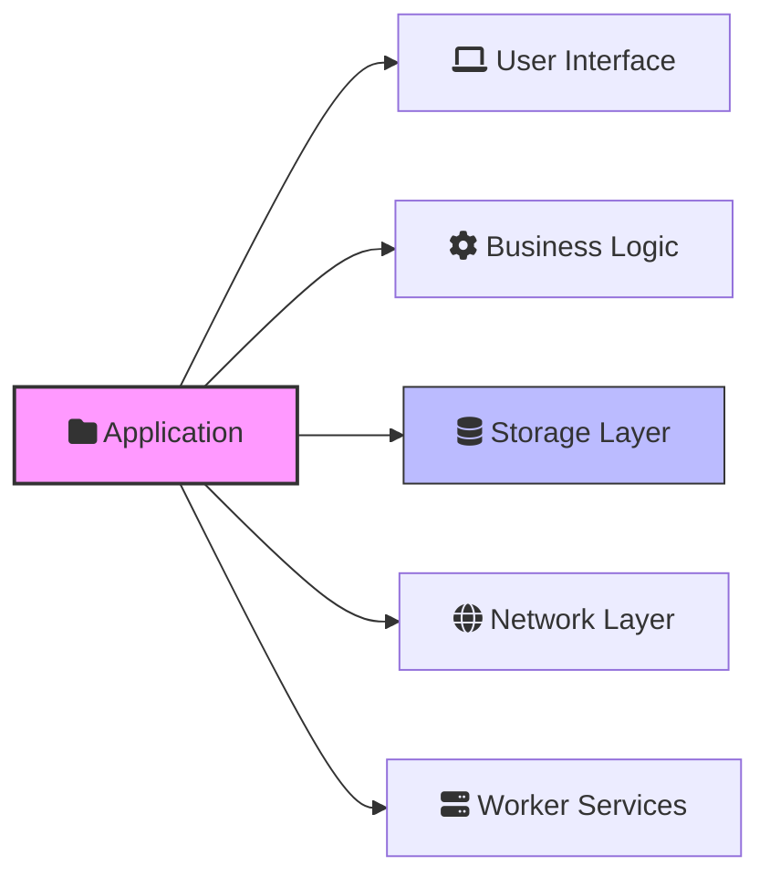
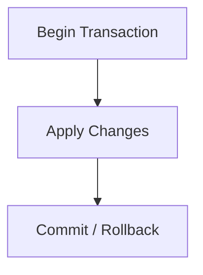
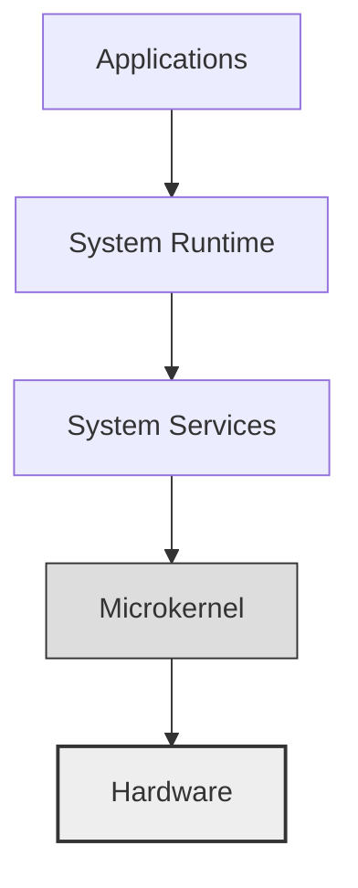
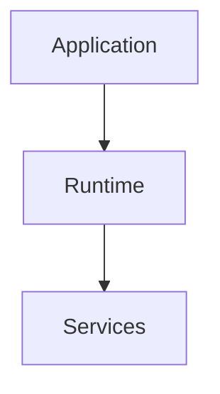
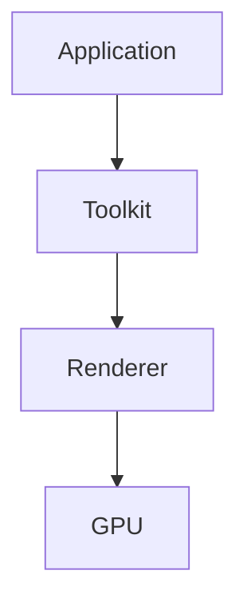
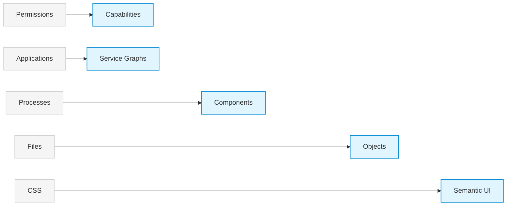

# IdealOS Architecture

> A research operating system exploring what computing could look like if it were designed today rather than evolving from Unix-era assumptions.

═════════════════════════════════════════════════════════

# ◉ Vision

 ***Concept*** 

IdealOS is an experimental operating system architecture that explores alternatives to many of the abstractions inherited from Unix and modern desktop systems.

The project is not an attempt to build a perfect operating system. It is a long-term research direction: an idealized target used to guide architectural decisions.

Rather than incrementally modernizing existing systems, IdealOS investigates what a modern operating system could look like if designed from first principles around contemporary hardware and software realities.

◆ Core Research Areas

• Object-oriented storage  
• Capability-based security  
• Native transactions  
• Composable applications  
• Built-in observability  
• GPU-first computing  
• Distributed object networking

═════════════════════════════════════════════════════════

# ◉ Design Principles

 ***Simplicity Through Few Concepts*** 

The system is intentionally built around a small set of fundamental abstractions.

| Concept      | Purpose                     |
|:------------:| --------------------------- |
| Objects      | Persistent resources        |
| Capabilities | Access control              |
| Transactions | Atomic state changes        |
| Components   | Application building blocks |
| Messages     | Communication primitive     |

The goal is to maximize expressiveness while minimizing conceptual complexity.

---

 ***Reliability*** 

Critical operations must always be:

✓ Atomic  
✓ Durable  
✓ Observable  
✓ Reversible

System state should never become partially updated or inconsistent.

---

 ***Security*** 

No resource is accessible implicitly.

Every operation requires an explicit capability.

Examples:

• Storage access  
• Networking  
• GPU execution  
• Device access  
• IPC  
• System services

Capability-based security is the default model of the system.

---

 ***Performance*** 

IdealOS is designed around modern hardware realities.

The runtime should efficiently utilize:

• Multi-core CPUs  
• GPUs  
• AI accelerators  
• Heterogeneous compute systems

Parallelism is considered a design assumption rather than an optimization.

---

 ***Composability*** 

Applications are not monolithic executables.

Instead, an application is viewed as a graph of independent components.



Each component can be observed, updated, replaced, and reused independently.

═════════════════════════════════════════════════════════

# ◉ Core Philosophy

 ***Everything Is an Object*** 

Objects are the primary abstraction of the system.

Examples:

```text
object://document/spec
object://window/main
object://dataset/users
object://gpu/buffer/42
object://service/audio
```

Objects replace the traditional filesystem-centric view of computing.

Files may still exist as a compatibility layer, but they are no longer the primary abstraction exposed by the system.

---

 ***Everything Is Transactional*** 

All critical mutations occur inside transactions.

Examples:

• Application installation  
• Software updates  
• Configuration changes  
• Permission modifications  
• Storage operations



A transaction either completes entirely or leaves the system unchanged.

---

 ***Everything Is Observable*** 

Observability is a built-in capability of the platform.

The system exposes:

• IPC activity  
• Memory activity  
• GPU workloads  
• Capability usage  
• Application dependencies  
• Transactions  
• Performance metrics

Debugging and profiling are system services rather than external tools.

═════════════════════════════════════════════════════════

# ◉ System Architecture

 ***High-Level Structure*** 




═════════════════════════════════════════════════════════

# ◉ Microkernel

 ***Concept*** 

The microkernel remains intentionally minimal.

◆ Responsibilities

• Thread scheduling  
• Virtual memory management  
• IPC  
• Interrupt handling  
• Isolation  
• Capability enforcement  
• Synchronization primitives

◆ Excluded Responsibilities

• Networking  
• Filesystems  
• Graphics  
• Audio  
• Package management  
• Application logic

Keeping the kernel small improves reliability, security, and maintainability.

═════════════════════════════════════════════════════════

# ◉ System Runtime

 ***Concept*** 

The runtime is the true center of the operating system.

It acts as a local distributed systems coordinator responsible for orchestrating higher-level functionality.

◆ Responsibilities

• Object management  
• Transaction orchestration  
• Capability resolution  
• Lifecycle management  
• Observability  
• Application composition



═════════════════════════════════════════════════════════

# ◉ User Interface Architecture

 ***Design Goal*** 

Applications describe intent.

The operating system determines presentation.

This approach avoids coupling application logic to rendering implementation details.

═════════════════════════════════════════════════════════

# ◉ ObjectUI

 ***Concept*** 

ObjectUI is the native declarative user interface framework.

```css
button {
    text: "Save"
    role: primary
}

window {
    title: "Editor"
}
```

Applications express semantics.

The system provides:

✓ Rendering  
✓ Animation  
✓ Accessibility  
✓ Adaptive layouts  
✓ Theming  
✓ GPU optimization

---

 ***Semantic Styling*** 

Instead of:

```css
background: blue;
padding: 12px;
```

Applications express intent:

```css
button {
    variant: primary
    density: compact
}
```

The runtime determines the final appearance.

═════════════════════════════════════════════════════════

# ◉ System Compositor

 ***Rendering Pipeline*** 

Traditional systems:



IdealOS:


The compositor owns:

• Rendering  
• Animations  
• Accessibility  
• Virtualization  
• Resource optimization

═════════════════════════════════════════════════════════

# ◉ AsterUI

 ***Concept*** 

AsterUI provides the reactive layer built on top of ObjectUI.

Inspired by ideas from React but designed specifically for operating-system-native interfaces.

◆ Features

• Components  
• Local state  
• Reactive updates  
• Incremental rendering  
• Hot reload  
• Native observability

◆ Unlike React

• No DOM  
• No browser  
• No CSS  
• Direct integration with system services

═════════════════════════════════════════════════════════

# ◉ GPU-First Architecture

 ***Concept*** 

The GPU is treated as a primary system resource.

◆ Capabilities

• GPU virtualization  
• GPU scheduling  
• Workload isolation  
• Native compute execution  
• Profiling and observability

The graphical stack is built entirely on top of this infrastructure.

═════════════════════════════════════════════════════════

# ◉ Compatibility Strategy

 ***Priority Order*** 

1. Native IdealOS Applications

2. WebAssembly Applications

3. POSIX Compatibility Layer

4. Virtualized Linux Environment

5. Progressive Windows Compatibility

Compatibility is important, but it does not drive architectural decisions.

═════════════════════════════════════════════════════════

# ◉ Artificial Intelligence

 ***Concept*** 

Artificial intelligence is integrated as a system capability.

◆ Use Cases

• Semantic search  
• Indexing  
• Automation  
• User assistance

◆ Constraints

✓ Local execution by default  
✓ Sandboxed models  
✓ Explicit permissions

AI remains a service rather than a privileged subsystem.

═════════════════════════════════════════════════════════

# ◉ Long-Term Research Directions

 ***Global Undo*** 

Eventually, users should be able to undo:

• Document modifications  
• Configuration changes  
• Installations  
• Application actions

---

 ***System Time Travel*** 

Navigate and inspect historical system states rather than merely restoring backups.

---

 ***Composable Applications*** 

Applications expose:

• Interfaces  
• Services  
• Pipelines  
• Datasets

Applications become reusable building blocks.

---

 ***Distributed Objects*** 

Objects may exist:

• Locally  
• Remotely  
• Across multiple devices

The runtime transparently manages synchronization and location.

═════════════════════════════════════════════════════════

# ◉ Technology Stack

| Area          | Technology            |
| ------------- | --------------------- |
| Language      | Rust                  |
| Architecture  | Microkernel           |
| Runtime       | Custom Object Runtime |
| UI            | ObjectUI + AsterUI    |
| Applications  | Native + WASM         |
| IPC           | Typed Messaging       |
| Serialization | Deterministic         |

═════════════════════════════════════════════════════════

# ◉ Guiding Principle

 ***Replacing Historical Constraints*** 

IdealOS does not seek to modernize Unix.

It explores what might replace some of Unix's historical abstractions.



The objective is a coherent operating system designed for observability, security, distributed computing, modern hardware, and long-term evolvability.
