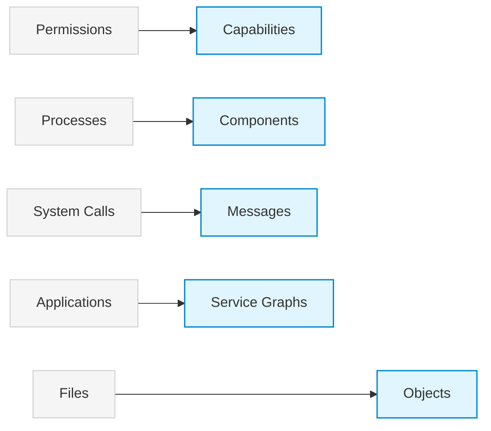

# IdealOS

> Experimental capability-based microkernel operating system written in Rust.

═════════════════════════════════════════════════════════

## ◉ What is IdealOS?

IdealOS is an educational and research-oriented operating system project focused on modern operating system architecture.

The project explores alternative foundations built around:

✓ Capability-based security

✓ Observable and typed IPC

✓ Strict userspace isolation

✓ Transactional system operations

✓ Structured system objects

✓ GPU-first architecture

✓ Distributed-ready runtime services

Rather than modernizing Unix, IdealOS investigates what could come after it.

═════════════════════════════════════════════════════════

## ◉ Vision

 ***Replacing Historical Constraints*** 


The long-term objective is a coherent operating system designed around:

• Observability

• Security

• Composability

• Modern hardware

• Distributed computing

═════════════════════════════════════════════════════════

## ◉ Project Status

 ***Early Development*** 

The current repository primarily contains:

• Microkernel infrastructure

• Memory management

• Process management

• Scheduling

• Capability systems

• IPC foundations

Many components remain experimental and are expected to evolve significantly.

This is currently a research platform rather than a production operating system.

═════════════════════════════════════════════════════════

## ◉ Current Progress

### Implemented

* [x] Physical Memory Manager
* [x] Virtual Memory Manager
* [x] Process abstraction
* [x] Scheduler
* [x] Capability framework
* [x] IPC primitives
* [x] Syscall infrastructure
* [x] UEFI boot support
* [x] BIOS boot support

### In Progress

* [ ] SMP support
* [ ] Typed IPC
* [ ] Zero-copy IPC
* [ ] Userspace services
* [ ] Runtime bootstrap

### Planned

* [ ] Object Store
* [ ] Transaction Engine
* [ ] Snapshot System
* [ ] POSIX Compatibility Layer
* [ ] WASM Runtime

═════════════════════════════════════════════════════════

## ◉ Documentation

If you want to understand the project, start here:

| Document          | Purpose                         |
| ----------------- | ------------------------------- |
| `ARCHITECTURE.md` | Long-term architectural vision  |
| `ROADMAP.md`      | Current implementation roadmap  |
| `AI_USAGE.md`     | AI usage and project philosophy |
| `CONTRIBUTING.md` | Contribution guidelines         |

═════════════════════════════════════════════════════════

## ◉ Building

### Install Dependencies

```bash
cargo xtask install-deps
```

### Build

```bash
cargo xtask build
```

### Run

```bash
cargo xtask run
```

═════════════════════════════════════════════════════════

## ◉ Development Commands

```bash
cargo xtask build
cargo xtask run
cargo xtask run-bios
cargo xtask run-release
cargo xtask debug
cargo xtask check
cargo xtask clippy
```

The same commands are also available through `make`.

═════════════════════════════════════════════════════════

## ◉ Debugging

```bash
cargo xtask debug

rust-gdb target/x86_64-kernel/debug/kernel

(gdb) target remote :1234
(gdb) break kernel_main
(gdb) continue
```

═════════════════════════════════════════════════════════

## ◉ Contributing

Contributions, discussions, ideas, criticism, and questions are welcome.

Before contributing, please read:

* `ARCHITECTURE.md`
* `ROADMAP.md`
* `CONTRIBUTING.md`

Architecture consistency is generally more important than feature count.

═════════════════════════════════════════════════════════

## ◉ License

Licensed under either of:

* MIT License
* Apache License 2.0

at your option.
